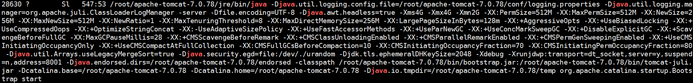

# Java经验记录(平时工作中遇到的问题,不知道的Api或。。。)
_一点优化，一点积累;一点优化，一点积累; 优化积累辣么多，是个人才_

## 一点优化
### JSON
#### JSON去掉多个属性
``` java
    List<String> list = new ArrayList<String>();
    if (!voChannelOSDInfo.isSuperposeName()) {
    	list.add("osd_text"); 
    }
    if (!voChannelOSDInfo.isSuperposeTime()) {
    	list.add("date");
    }
    //去掉json某一属性
    jsonConfig.setExcludes(list.toArray(new String[list.size()]));
    JSONObject osdJson = JSONObject.fromObject(voVideoWordOverlay,jsonConfig);
```
### List
#### 清空指定List元素
``` java
<!-- 将截取的元素清空 截取后的元素引用地址与List一致 -->
list.subList(1,3).clear();
```

### Transaction
#### PO不能及时提交，PO开启事务
``` java
Session tabFtpPictureSession = null;
try{
    tabFtpPictureSession = tabFtpPictureDAO.getSessionFactory().openSession();
    Transaction tabFtpPictureTransaction = tabFtpPictureSession.beginTransaction();
    tabFtpPicture.setSId(picId);
    tabFtpPictureSession.save(tabFtpPicture);
    tabFtpPictureTransaction.commit();
} finally {
    if(tabFtpPictureSession != null) {
        tabFtpPictureSession.flush();
        tabFtpPictureSession.clear();
        tabFtpPictureSession.close();
    }
}
```
## 问题排查
### jstack使用
``` linux
<!-- 使用ps命令查看java的进程号 -->
ps -ax | grep java
```

``` linux
<!-- jstack -l 进程号 -->
jstack -l 28630 > /root/jstack-28630.txt
```
分析log中***TIMED_WAITING*** 或 ***BLOCKED*** 

**进阶用法(暂时还未使用，因为遇到的问题普通用法都已解决)**
    - 先用top查看java的进程Id
	- 在用 ps p 进程Id -L -o pcpu,pid,tid,time,tname,cmd 通过进程Id查看该进程里面哪个线程占用cpu高
	- 在用 printf "%x\n" 线程Id 查看线程号
	- 然后用jstack转存一份文件，搜索进程号，看到详细错误日志

