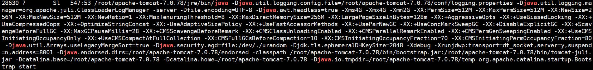

# Java经验记录(平时工作中遇到的问题,不知道的Api或。。。)
_一点优化，一点积累;一点优化，一点积累; 优化积累辣么多，是个人才_

## 一点优化
### JSON
#### JSON去掉多个属性
``` java
    List<String> list = new ArrayList<String>();
    if (!voChannelOSDInfo.isSuperposeName()) {
    	list.add("osd_text"); 
    }
    if (!voChannelOSDInfo.isSuperposeTime()) {
    	list.add("date");
    }
    //去掉json某一属性
    jsonConfig.setExcludes(list.toArray(new String[list.size()]));
    JSONObject osdJson = JSONObject.fromObject(voVideoWordOverlay,jsonConfig);
```
### List
#### 清空指定List元素
``` java
<!-- 将截取的元素清空 截取后的元素引用地址与List一致 -->
list.subList(1,3).clear();
```

### Transaction
#### PO不能及时提交，PO开启事务
``` java
Session tabFtpPictureSession = null;
try{
    tabFtpPictureSession = tabFtpPictureDAO.getSessionFactory().openSession();
    Transaction tabFtpPictureTransaction = tabFtpPictureSession.beginTransaction();
    tabFtpPicture.setSId(picId);
    tabFtpPictureSession.save(tabFtpPicture);
    tabFtpPictureTransaction.commit();
} finally {
    if(tabFtpPictureSession != null) {
        tabFtpPictureSession.flush();
        tabFtpPictureSession.clear();
        tabFtpPictureSession.close();
    }
}
```
## JPA
### crud
定义实体类 成员变量上注解与数据库表字段对应
``` java
package com.bigdou.entity;

import lombok.AllArgsConstructor;
import lombok.Builder;
import lombok.Data;
import lombok.NoArgsConstructor;
import org.hibernate.annotations.CreationTimestamp;
import org.hibernate.annotations.UpdateTimestamp;
import javax.persistence.*;
import java.io.Serializable;
import java.util.Date;

@Data
@Builder
@Table
@Entity
@NoArgsConstructor
@AllArgsConstructor
public class User implements Serializable{

    /**
     * @Id 表明该字段是主键Id
     * @GeneratedValue 策略生成器 
     * strategy：
     * TABLE：使用一个特定的数据库表格来保存主键。 
     * SEQUENCE：根据底层数据库的序列来生成主键，条件是数据库支持序列。 
     * IDENTITY：主键由数据库自动生成（主要是自动增长型） 
     * AUTO：主键由程序控制。
     */
    @Id
    @GeneratedValue(strategy = GenerationType.IDENTITY)
    private Long id;
    
    @Column(name = "user_name")
    private String userName;

    private String password;
    
    /**
     * @Column(name = "gmt_create",updatable = false) 数据库列 name字段名 updatable=false 不更新
     * @CreationTimestamp 创建该数据的时间戳
     * @UpdateTimestamp 更新该数据的时间戳
     */
    @Column(name = "gmt_create",updatable = false)
    @CreationTimestamp
    private Date createTime;

    @Column(name = "gmt_modified")
    @UpdateTimestamp
    private Date updateTime;

}

```
定义接口继承CrudRepository<Entity, ID>
CrudRepository中包含基本增删改查
``` java
package com.bigdou.dao;

import com.bigdou.entity.User;
import org.springframework.data.repository.CrudRepository;

public interface UserDao extends CrudRepository<User, Long> {
}

```
基本调用，定义Controller
``` java
package com.bigdou.controller;

import com.bigdou.entity.User;
import com.bigdou.mapper.UserMapper;
import com.bigdou.service.UserService;
import org.springframework.beans.factory.annotation.Autowired;
import org.springframework.web.bind.annotation.RequestMapping;
import org.springframework.web.bind.annotation.RequestParam;
import org.springframework.web.bind.annotation.RestController;

import java.util.List;

@RestController
@RequestMapping("/user")
public class UserController {

    @Autowired
    private UserService userService;

    /**
     * 描述：查询所有用户
     */
    @RequestMapping("/queryUserAll")
    public List<User> queryUserAll() {
        return userService.listUser();
    }

    @RequestMapping("/addUser")
    public void addUser(@RequestParam(name = "userName") String userName,
                        @RequestParam(name = "password") String password) {
        userService.addUser(User.builder().userName(userName).password(password).build());
    }

}

```
定义Service
``` java
package com.bigdou.service;

import cn.hutool.core.util.StrUtil;
import com.bigdou.dao.UserDao;
import com.bigdou.entity.User;
import lombok.extern.slf4j.Slf4j;
import org.springframework.beans.factory.annotation.Autowired;
import org.springframework.stereotype.Service;

import java.util.ArrayList;
import java.util.List;

@Service
@Slf4j
public class UserService {
    
    @Autowired
    private UserDao userDao;

    public List<User> listUser() {
        List<User> listUser = new ArrayList<>();
        userDao.findAll().forEach(row -> {
            listUser.add(User.builder().id(row.getId()).userName(row.getUserName())
                    .password(row.getPassword()).createTime(row.getCreateTime())
                    .updateTime(row.getUpdateTime()).build());
        });
        return listUser;
    }

    public void addUser(User user) {
        if (user == null) {
            log.error("addUser user is null");
            return;
        }
        if (StrUtil.isEmpty(user.getUserName())) {
            log.error("addUser userName is null");
            return;
        }
        if (StrUtil.isEmpty(user.getPassword())) {
            log.error("addUser password is null");
            return;
        }
        User userEntity = User.builder().userName(user.getUserName()).password(user.getPassword()).build();
        userDao.save(userEntity);
    }

}
```
## MyBatis
### Mapper映射配置

## 问题排查
### jstack使用
``` linux
<!-- 使用ps命令查看java的进程号 -->
ps -ax | grep java
```

``` linux
<!-- jstack -l 进程号 -->
jstack -l 28630 > /root/jstack-28630.txt
```
分析log中***TIMED_WAITING*** 或 ***BLOCKED*** 

**进阶用法(暂时还未使用，因为遇到的问题普通用法都已解决)**
    - 先用top查看java的进程Id
	- 在用 ps p 进程Id -L -o pcpu,pid,tid,time,tname,cmd 通过进程Id查看该进程里面哪个线程占用cpu高
	- 在用 printf "%x\n" 线程Id 查看线程号
	- 然后用jstack转存一份文件，搜索进程号，看到详细错误日志

