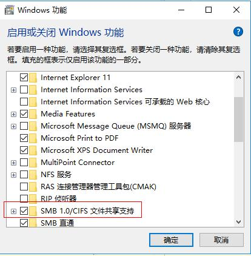

# Linux常用命令
_本来只是打算干Java，为啥dojo、php、linux都需要做泪奔_


## mount
### mount无权限
``` linux
<!-- 增加sec=ntlm -->
mount -v -t cifs -o username=tiandy,password=1111,sec=ntlm //10.30.50.112/setup /root/setup/
```

### mount提示host is down
#### win10
1. 启用win10 windows功能SMB文件共享

2. 关闭防火墙

3. 启用windows文件夹共享


## netstat
### 查看端口占用
``` linux
netstat -tnpl
```
### 查看mysql连接数
``` linux
netstat -anpt | grep 3306 | wc -l
```
### 查看mysql连接信息
``` linux
netstat -anpt | grep 3306
```
## vim
``` linux
<!-- vim到文件中使用set nu查看行号 -->
set nu
```
